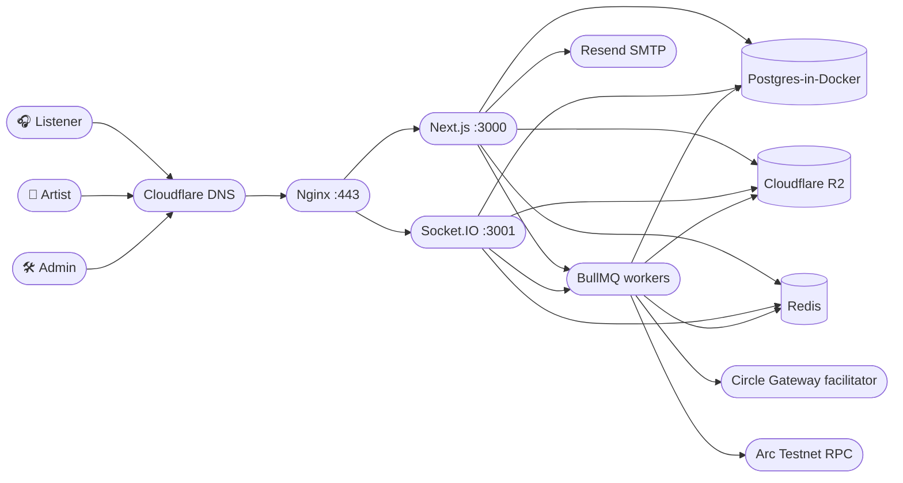
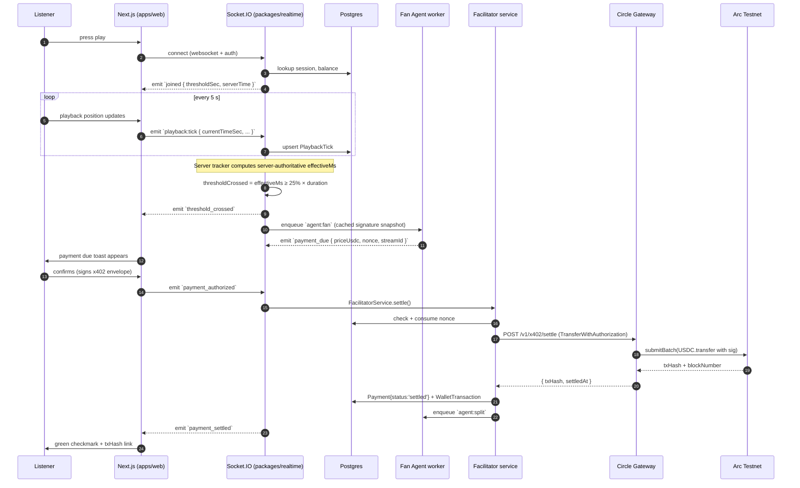
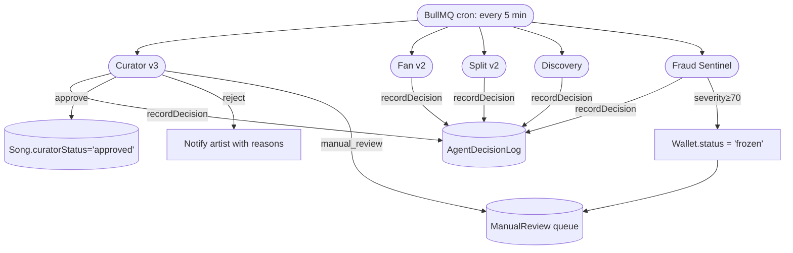

# Pazzera architecture

> Source-of-truth architecture diagram and data flow map. All `Mermaid`
> blocks render natively on GitHub.

## Monolith deployment



## Real-time playback sequence



## AI agent decision flow



## Data model (logical)

```
User ──< Song ──< RoyaltyRecipient ──→  User (internal)  OR  external wallet
User ──1:1── Wallet  ──< WalletTransaction
User ──< Stream ──1:1── Payment ──< Payout ──< LedgerEntry
User ──1:1── SongMetrics / ArtistMetrics / DailyMetrics
Song ──1:1── SongMetrics
User ──< AgentDecisionLog (deterministic, deduplicated by inputHash)
User ──< FraudAlert
Wallet ──< indexerCursor  (Json)
Payment ──1:1── PaymentNonce + PaymentEvent
```

## Strict-typing architecture

```
@types modules (apps/web/types, packages/*/types/)  ← shared .d.ts stubs
                ↓
tsconfig.base.json (strict: true, noUncheckedIndexedAccess: true)
                ↓
per-package tsconfig (extends base, includes cross-package src)
                ↓
CI: pnpm -r typecheck → pnpm -r test → pnpm --filter web test:e2e
```

No per-callback `as any`. No per-package `strict: false`. Every type
boundary flows through a reusable helper under `packages/db/src/utils/`.

## Observability

```
Client → API route (apps/web/app/api/...)
            ↓ assigns correlation ID via X-Request-Id header or mint
            ↓ logger.setBindings({ requestId })
       handler runs
            ↓ emits structured pino logs (service=pazzera)
       Socket.IO server → emits structured pino logs (service=realtime)
            ↓
       CloudWatch / Datadog / Axiom (in production)

Client crash → /api/log/client-error → joins correlation ID
            ↓
       Server-side logger.warn({ kind: 'client_error', ... })
```

## Hardening hot-spots

- `apps/web/lib/realtime-client.ts` — manual retry-with-jitter, six
  `ConnectionStatus` states, explicit `AbortSignal` on backoff,
  `data-connection-status` body attribute for the e2e suite.
- `packages/core/src/middleware/with-api.ts` — correlation-ID
  minting + propagation, request-bound logger bindings.
- `apps/web/components/error-boundary.tsx` — typed `ErrorBoundary`
  with retry / navigation fallback.
- `apps/web/app/error.tsx` — root App Router error UI.
- `apps/web/app/not-found.tsx` — 404 UI.
- `apps/web/app/loading.tsx` — suspense fallback.
- `apps/web/lib/retry.ts` — exponential backoff with jitter.
```
